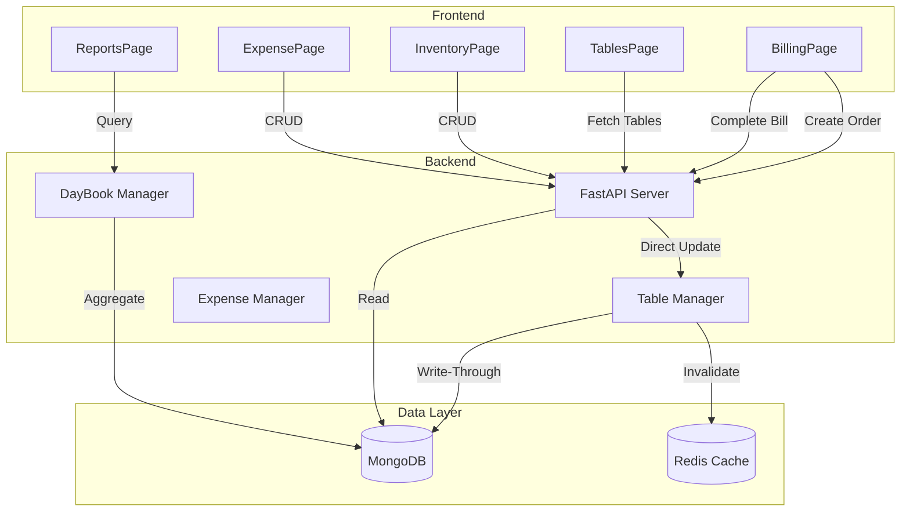

# Design Document: Restaurant Enhancements

## Overview

This design addresses critical performance and functionality improvements for the restaurant management system:
1. Real-time table status synchronization with direct database updates
2. Menu loading performance with loading states
3. Enhanced inventory management with supplier/category creation
4. Expense tracking and management
5. Day Book/Cash Flow reporting

The architecture prioritizes immediate data consistency for table operations while maintaining caching for read-heavy operations.

## Architecture



## Components and Interfaces

### 1. Table Status Manager (Backend)

Handles immediate table status updates with write-through to database.

```python
class TableStatusManager:
    async def set_table_occupied(org_id: str, table_id: str, order_id: str) -> bool:
        """
        Immediately set table to occupied when order is created.
        Uses direct DB update, then invalidates cache.
        Returns success status.
        """
        
    async def set_table_available(org_id: str, table_id: str) -> bool:
        """
        Immediately set table to available when bill is completed.
        Uses direct DB update, then invalidates cache.
        Returns success status.
        """
        
    async def get_tables_fresh(org_id: str) -> List[Table]:
        """
        Fetch tables directly from database, bypassing cache.
        Used for critical operations requiring fresh data.
        """
```

### 2. Menu Loading Component (Frontend)

Enhanced menu fetching with loading states.

```typescript
interface MenuLoadingState {
  isLoading: boolean;
  error: string | null;
  menuItems: MenuItem[];
  lastFetched: number;
}

const useMenuWithLoading = (orgId: string) => {
  // Show loading state immediately on navigation
  // Cache menu items in localStorage for faster subsequent loads
  // Provide retry functionality on error
}
```

### 3. Inventory Enhancement APIs (Backend)

```python
# Supplier Management
@api_router.post("/inventory/suppliers")
async def create_supplier(supplier: SupplierCreate) -> Supplier

@api_router.put("/inventory/suppliers/{id}")
async def update_supplier(id: str, supplier: SupplierUpdate) -> Supplier

@api_router.delete("/inventory/suppliers/{id}")
async def delete_supplier(id: str) -> dict

# Category Management  
@api_router.post("/inventory/categories")
async def create_category(category: CategoryCreate) -> Category

@api_router.put("/inventory/categories/{id}")
async def update_category(id: str, category: CategoryUpdate) -> Category

@api_router.delete("/inventory/categories/{id}")
async def delete_category(id: str) -> dict
```

### 4. Expense Management APIs (Backend)

```python
class Expense(BaseModel):
    id: str
    date: datetime
    amount: float
    category: str  # Rent, Utilities, Salaries, Supplies, Maintenance, Marketing, Other
    description: str
    payment_method: str  # cash, card, upi, bank_transfer
    vendor_name: Optional[str]
    receipt_url: Optional[str]
    organization_id: str
    created_by: str
    created_at: datetime

@api_router.get("/expenses")
async def get_expenses(
    start_date: Optional[str],
    end_date: Optional[str],
    category: Optional[str]
) -> List[Expense]

@api_router.post("/expenses")
async def create_expense(expense: ExpenseCreate) -> Expense

@api_router.put("/expenses/{id}")
async def update_expense(id: str, expense: ExpenseUpdate) -> Expense

@api_router.delete("/expenses/{id}")
async def delete_expense(id: str) -> dict
```

### 5. Day Book / Cash Flow Report APIs (Backend)

```python
class DayBookEntry:
    timestamp: datetime
    type: str  # inflow, outflow
    category: str
    description: str
    amount: float
    running_balance: float
    reference_id: Optional[str]

class DayBookReport:
    date: str
    opening_balance: float
    total_inflows: float
    total_outflows: float
    closing_balance: float
    entries: List[DayBookEntry]
    inflow_breakdown: Dict[str, float]
    outflow_breakdown: Dict[str, float]

@api_router.get("/reports/daybook")
async def get_daybook(
    date: str,  # YYYY-MM-DD
    end_date: Optional[str]  # For date range
) -> DayBookReport

@api_router.get("/reports/daybook/export")
async def export_daybook(
    date: str,
    format: str  # pdf, excel
) -> StreamingResponse
```

## Data Models

### Expense Model
```python
{
    "id": "uuid",
    "date": "2026-01-12T10:30:00Z",
    "amount": 5000.00,
    "category": "Rent",
    "description": "Monthly shop rent",
    "payment_method": "bank_transfer",
    "vendor_name": "Landlord Name",
    "receipt_url": null,
    "organization_id": "org_uuid",
    "created_by": "user_uuid",
    "created_at": "2026-01-12T10:30:00Z",
    "updated_at": "2026-01-12T10:30:00Z"
}
```

### Supplier Model (Enhanced)
```python
{
    "id": "uuid",
    "name": "Supplier Name",
    "contact_person": "Contact Name",
    "phone": "+91XXXXXXXXXX",
    "email": "supplier@email.com",
    "address": "Full Address",
    "gstin": "GSTIN Number",
    "payment_terms": "Net 30",
    "notes": "Additional notes",
    "organization_id": "org_uuid",
    "created_at": "2026-01-12T10:30:00Z"
}
```

### Inventory Category Model (Enhanced)
```python
{
    "id": "uuid",
    "name": "Category Name",
    "description": "Category description",
    "color": "#7c3aed",
    "organization_id": "org_uuid",
    "created_at": "2026-01-12T10:30:00Z"
}
```

## Correctness Properties

*A property is a characteristic or behavior that should hold true across all valid executions of a system—essentially, a formal statement about what the system should do. Properties serve as the bridge between human-readable specifications and machine-verifiable correctness guarantees.*

### Property 1: Table Status Synchronization

*For any* order creation or bill completion operation, the table status in the database SHALL immediately reflect the correct state (occupied for new orders, available for completed bills), and subsequent table fetches SHALL return this updated state.

**Validates: Requirements 1.1, 1.2, 1.4**

### Property 2: Cache Invalidation on Table Update

*For any* table status change, the cache invalidation SHALL occur, ensuring that the next read operation returns fresh data from the database rather than stale cached data.

**Validates: Requirements 1.3, 1.5**

### Property 3: Supplier Data Persistence

*For any* supplier creation with valid name, contact, and address fields, the system SHALL persist all provided fields to the database, and subsequent retrieval SHALL return the exact same data.

**Validates: Requirements 3.2**

### Property 4: Category Data Persistence

*For any* category creation with valid name and description, the system SHALL persist all provided fields to the database, and subsequent retrieval SHALL return the exact same data.

**Validates: Requirements 3.3**

### Property 5: Inventory Item Validation

*For any* inventory item submission missing required fields (name, quantity, unit, min_quantity, price_per_unit), the system SHALL reject the submission and return a validation error.

**Validates: Requirements 3.7**

### Property 6: Expense Data Persistence

*For any* expense creation with valid date, amount, category, description, and payment method, the system SHALL persist all provided fields to the database, and subsequent retrieval SHALL return the exact same data.

**Validates: Requirements 4.2**

### Property 7: Expense Total Consistency

*For any* set of expenses in a date range, the total displayed SHALL equal the sum of all individual expense amounts. After any edit or delete operation, the total SHALL be recalculated correctly.

**Validates: Requirements 4.5, 4.6, 4.7**

### Property 8: Expense Filtering Correctness

*For any* filter combination (date range and/or category), the returned expenses SHALL only include records matching ALL specified filter criteria.

**Validates: Requirements 4.4**

### Property 9: Cash Flow Balance Invariant

*For any* day book report, the closing balance SHALL equal: opening_balance + total_inflows - total_outflows. This invariant must hold for single day and date range reports.

**Validates: Requirements 5.4**

### Property 10: Transaction Categorization

*For any* completed order, the system SHALL categorize the payment as inflow under the correct category (Sales-Cash, Sales-Card, Sales-UPI) based on payment method. *For any* recorded expense, the system SHALL categorize it as outflow under the appropriate category.

**Validates: Requirements 5.2, 5.3**

### Property 11: Date Range Aggregation

*For any* date range selection in the day book, the report SHALL aggregate all transactions from all dates in the range, with correct running balances calculated chronologically.

**Validates: Requirements 5.5**

## Error Handling

### Table Status Update Failures
- Retry once on failure
- Log error with full context
- Return error to frontend for user notification
- Frontend shows toast with retry option

### Inventory Save Failures
- Validate all required fields before API call
- Display specific field-level errors
- Preserve form data on failure for retry

### Expense Operation Failures
- Validate amount > 0
- Validate date is not in future
- Display specific error messages
- Allow retry without data loss

## Testing Strategy

### Unit Tests
- Validate expense calculation logic
- Validate day book balance calculations
- Test filter logic for expenses
- Test category assignment logic

### Property-Based Tests
Using Python's Hypothesis library for backend tests:

1. **Table Status Sync Property Test**: Generate random order creation/completion sequences and verify table status consistency
2. **Expense Total Property Test**: Generate random expense sets and verify total calculation
3. **Cash Flow Invariant Property Test**: Generate random transaction sequences and verify balance equation
4. **Filter Correctness Property Test**: Generate random filter combinations and verify results match criteria

### Integration Tests
- End-to-end order creation → table occupied flow
- End-to-end bill completion → table available flow
- Expense CRUD operations
- Day book report generation with real data

### Configuration
- Minimum 100 iterations per property test
- Tag format: **Feature: restaurant-enhancements, Property {number}: {property_text}**
